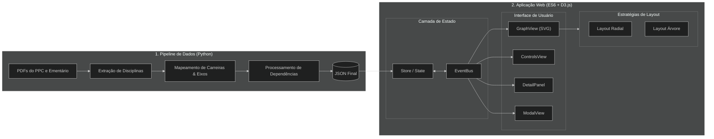

# Mapa de Carreira Radial - BSI IFMG OB
> Aplicação web interativa para mapeamento e visualização do ecossistema curricular do curso de Bacharelado em Sistemas de Informação (BSI) do IFMG - Campus Ouro Branco.

**Link da Aplicação / Deploy:** https://radial-career-map.vercel.app/

---

### Sobre o Projeto
O Mapa de Carreira Radial resolve a complexidade na visualização do fluxo curricular e do direcionamento profissional do curso de Bacharelado em Sistemas de Informação. A ferramenta permite analisar a estrutura do curso sob duas óticas principais:
* **Afinidade Profissional:** Organização e posicionamento concêntrico das disciplinas em relação a 14 perfis de carreira do mercado de TI.
* **Dependência Curricular:** Navegação interativa através da árvore de pré-requisitos e encadeamento topológico de disciplinas.

#### Tecnologias Utilizadas
* **Front-End:** JavaScript (ES6+), D3.js (v7), HTML5, CSS3
* **Data Engineering:** Python 3, pdfplumber
* **Hospedagem:** Vercel

---

### Fluxo da Aplicação
A aplicação divide-se em um pipeline offline de engenharia de dados em Python e uma camada reativa visual na web alimentada por D3.js.



---

### Arquitetura e Estrutura de Pastas

```text
.
├── data/
│   ├── raw/                      # Documentos originais em PDF (PPC e Ementário)
│   └── processed/                # Datasets JSON consumidos pela aplicação web
├── docs/                         # Documentação técnica e planejamento do projeto
├── scripts/                      # Pipelines de extração e transformação em Python
│   ├── 1-extrair-disciplinas.py
│   ├── 2-inserir-camadas-por-profissao.py
│   ├── 3-inserir-eixos.py
│   ├── 4-inserir-dependencias.py
│   └── 5-criar-arestas.py
├── src/                          # Código-fonte da aplicação web
│   ├── core/                     # EventBus e Store reativo
│   ├── domain/                   # Consultas em grafo e normalizadores
│   ├── strategies/               # Algoritmos de Layout (Radial e Tree)
│   ├── ui/                       # Componentes de interface e renderização D3
│   ├── main.js                   # Bootstrap da aplicação
│   └── style.css                 # Estilização global
├── index.html                    # Documento HTML principal
├── requirements.txt              # Dependências Python dos scripts de dados
└── README.md
```

---

### Instalação e Execução

#### Pré-requisitos

* Servidor web HTTP simples (ex: Live Server do VS Code, Python `http.server` ou Node `http-server`).
* Python 3.x (necessário apenas para reprocessamento de dados).

#### Execução da Aplicação Web

1. Clone o repositório:
```bash
git clone https://github.com/moimanu/system-information-radial-career-map.git
```

2. Inicie um servidor HTTP na raiz do projeto:
```bash
python -m http.server 8000

```

3. Acesse em seu navegador: `http://localhost:8000`

#### Reprocessamento dos Dados (Opcional)

Para extrair e reprocessar os dados a partir dos PDFs originais:

1. Instale as dependências Python:
```bash
pip install -r requirements.txt

```

2. Execute a sequência de scripts:
```bash
cd scripts
python 1-extrair-disciplinas.py
python 2-inserir-camadas-por-profissao.py
python 3-inserir-eixos.py
python 4-inserir-dependencias.py
python 5-criar-arestas.py
```