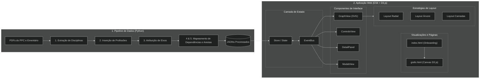

[← Voltar](../README.md)

# Arquitetura do Sistema

O Mapa de Carreira Radial é estruturado em uma arquitetura desacoplada e reativa baseada no padrão Model-View-Controller (MVC), dividida entre uma etapa offline de engenharia de dados (Python) e uma aplicação web interativa em tempo real (ES6 + D3.js).

---

## Estrutura de Pastas

```text
.
├── data/
│   ├── raw/                      # Documentos originais em PDF (PPC e Ementário)
│   └── processed/                # Datasets JSON consumidos pela aplicação web
├── docs/                         # Documentação técnica e planejamento do projeto
├── scripts/                      # Pipelines de extração e transformação em Python
├── src/                          # Código-fonte da aplicação web
│   ├── assets/                   # Assets da aplicação
│   ├── core/                     # EventBus e Store reativo
│   ├── domain/                   # Consultas em grafo e normalizadores
│   ├── strategies/               # Algoritmos de Layout (Radial e Tree)
│   ├── ui/                       # Componentes de interface e renderização D3
│   ├── main.js                   # Bootstrap da aplicação
│   └── style.css                 # Estilização global
├── index.html                    # Documento HTML principal
├── requirements.txt              # Dependências Python dos scripts de dados
└── README.md
```

---

## Módulos e Camadas (MVC)

### 1. Model (Camada de Dados e Estado)

A camada Model é composta pelos datasets processados no pipeline offline e gerenciada centralmente no cliente pelo estado reativo da aplicação.

* **Pipeline de Dados (Python):** Extrai dados dos PDFs originais (PPC e Ementário) via scripts em Python (`pdfplumber`) e gera os arquivos JSON estruturados.
* **Store (`src/core/Store.js`):** Atua como o modelo de estado em tempo de execução no front-end. Armazena os nós, arestas, filtros de eixos/natureza e o perfil profissional selecionado.

### 2. View (Camada de Apresentação e Componentes)

A camada View é responsável por renderizar a interface do usuário e as visualizações interativas em SVG/D3.js com base nas atualizações enviadas pelo Model.

* **Views de Página:** `index.html` (Onboarding) e `grafo.html` (Canvas D3.js).
* **Componentes de Interface (UI):** `GraphView`, `ControlsView`, `DetailPanel` e `ModalView`.
* **Estratégias de Layout (`src/strategies/`):** Algoritmos de posicionamento visual consumidos pelo `GraphView` (Layout Radial, Layout Árvore e Layout Camadas).

### 3. Controller (Barramento de Eventos e Orquestração)

A camada Controller faz a ponte entre as interações do usuário nas Views e as alterações de estado no Model, utilizando o padrão Observer / Pub-Sub.

* **EventBus (`src/core/EventBus.js`):** Funciona como o barramento central de eventos da aplicação (`EventBus`), desacoplando a interface do estado.
* **Bootstrap (`src/main.js`):** Atua como o ponto de entrada da aplicação, inicializando a carga dos arquivos JSON, a instância do `Store`, do `EventBus` e ligando a comunicação dos componentes UI.

---

## Mapeamento de Componentes

